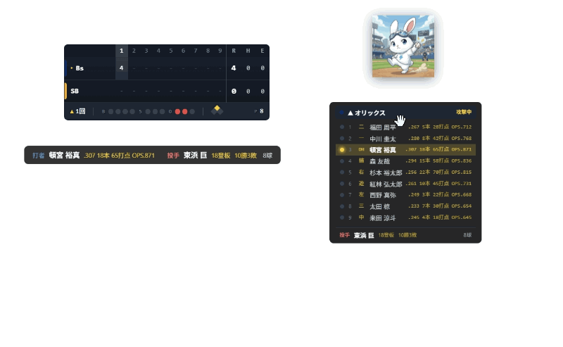
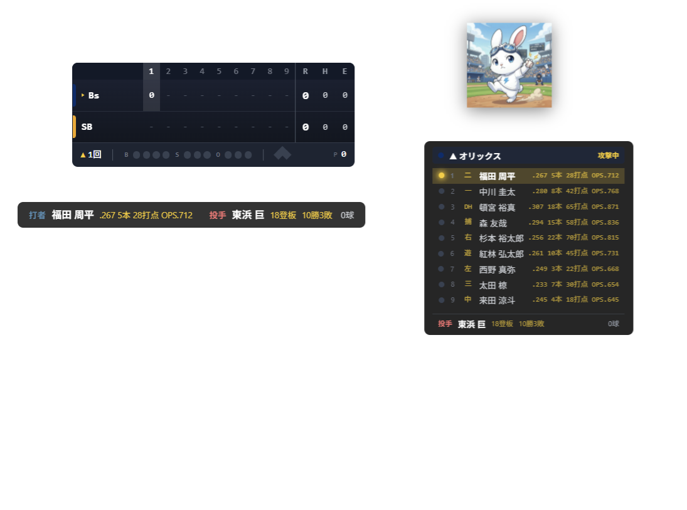
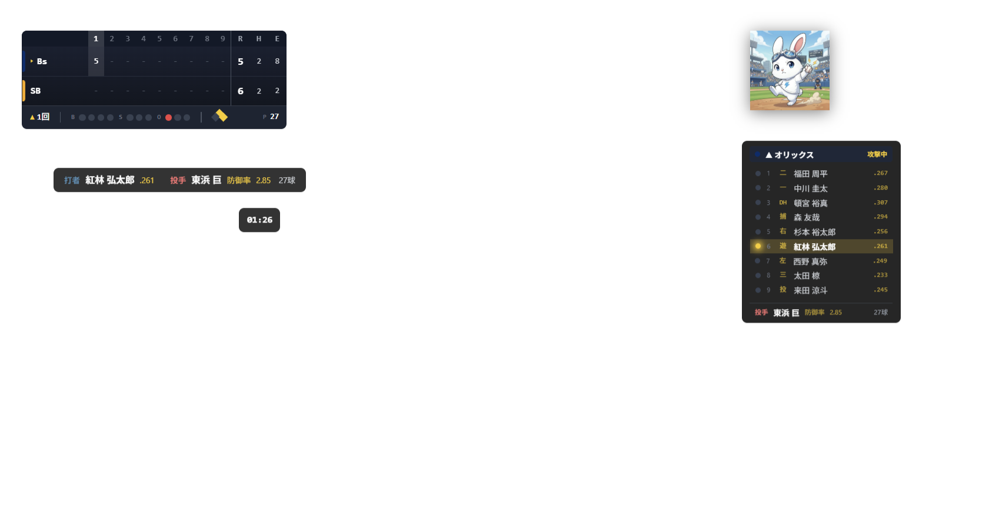
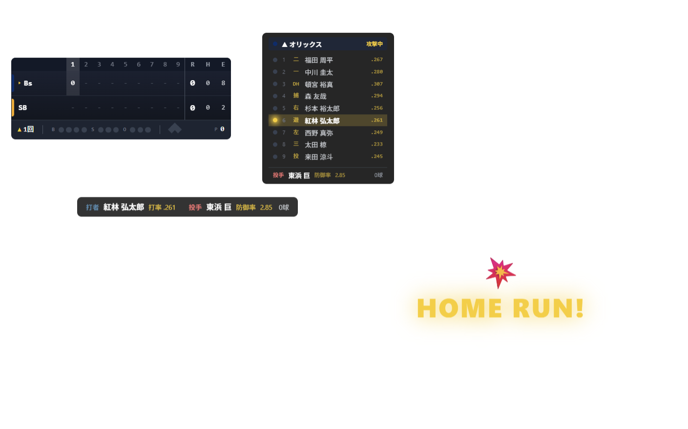
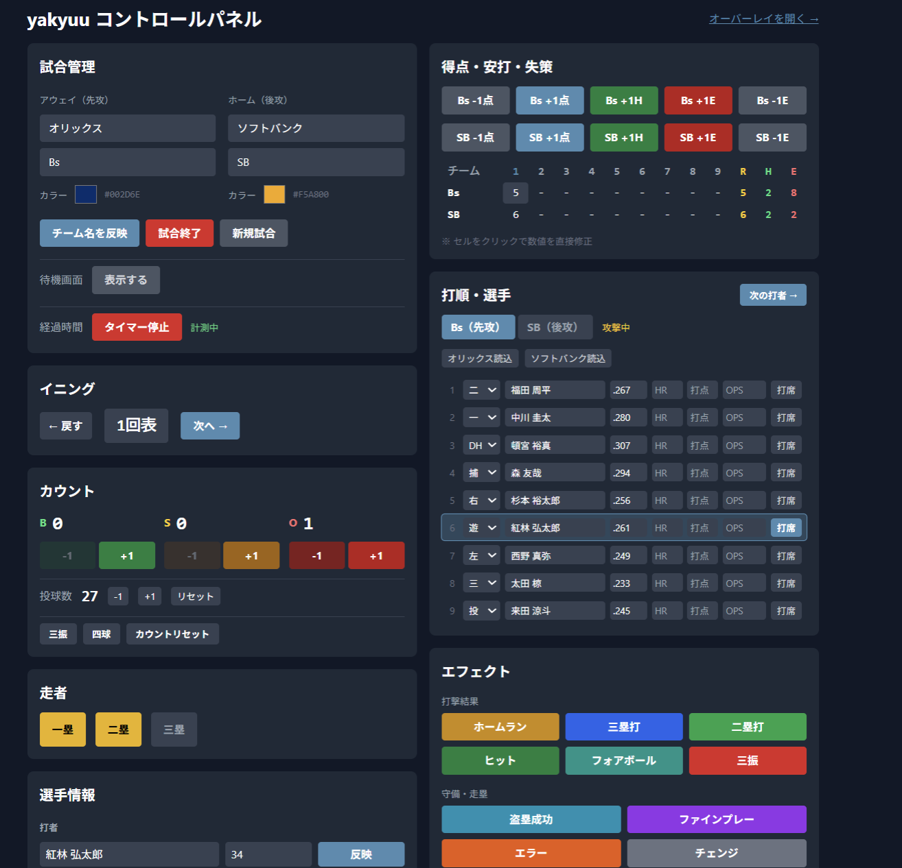
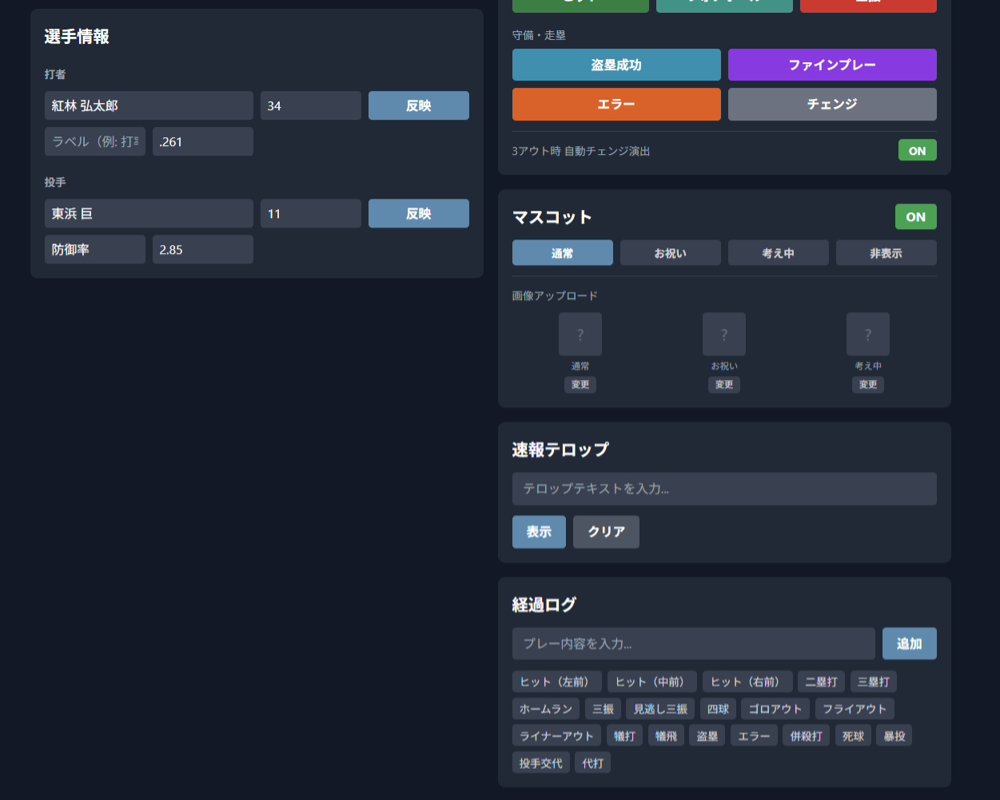

# yakyuu - 野球ライブ配信用スコアボードオーバーレイ

草野球・少年野球のYouTubeライブ配信やOBS配信で使える、テレビ中継風スコアボードオーバーレイです。
サーバー不要・インストール不要・無料。ブラウザだけで動作します。

**Demo**: [https://tsubasagit.github.io/yakyuu/](https://tsubasagit.github.io/yakyuu/)



## スクリーンショット

### オーバーレイ（OBSブラウザソース）



透明背景のスコアボード・打順カード・打者/投手情報・マスコットを配信映像に重ねて表示。
全パネルをドラッグで自由に配置できます。

#### 試合進行中



スコア・BSO・走者・球数・経過時間がリアルタイムに反映。マスコット（ラピットくん）が試合を盛り上げます。

#### エフェクト演出



ホームラン・三振・ヒット・盗塁・ファインプレー・エラー・フォアボール・チェンジなど10種類のエフェクトアニメーション。3アウト時のチェンジ演出は全幅スライドバナーで自動発火します。

### コントロールパネル



スコアキーパーが操作する画面。チーム・選手・スコア・カウントをリアルタイムに操作できます。



マスコットの表示切替・画像アップロード、エフェクト発火、速報テロップ、経過ログもここから操作。

## 機能

### オーバーレイ (`/#/overlay`)
- イニング別スコア（9回＋延長対応）
- BSO（ボール・ストライク・アウト）カウント
- 走者ダイヤモンド表示
- 攻撃チームの打順カード（打率・HR・打点・OPS）
- 投手情報（登板数・勝敗・投球数）
- 演出エフェクト10種（ホームラン・三振・二塁打・三塁打・ヒット・盗塁・ファインプレー・エラー・フォアボール・チェンジ）
- 3アウト時チェンジ演出の自動発火（チームカラー付き全幅バナー）
- マスコット表示（通常・お祝い・考え中モード + カスタム画像対応）
- 試合前待機画面（「まもなく試合開始」+ チーム名表示）
- 速報テロップ（ティッカー表示）
- 経過時間タイマー
- ドラッグで各パネルの位置を自由に配置

### コントロールパネル (`/#/control`)
- チーム名・略称・チームカラー設定
- イニング進行・巻き戻し
- B/S/O カウント加減算・三振/四球ワンタップ
- 得点・安打・失策の+1/-1操作
- 9人の野手登録（打率・HR・打点・OPS）
- 投手を10番目の選手として登録（登板数・勝敗）
- 走者ON/OFF
- エフェクト発火（打撃結果 / 守備・走塁の2カテゴリ）
- マスコットON/OFF・モード切替・画像アップロード
- 試合前待機画面の表示/非表示
- プレーバイプレーログ（テンプレートボタン付き）
- デモデータプリセット読み込み

## 使い方

1. [コントロールパネル](https://tsubasagit.github.io/yakyuu/#/control) をブラウザで開く
2. チーム名・選手情報を入力（デモデータのプリセットも用意）
3. OBSで「ブラウザソース」を追加し、URL に `https://tsubasagit.github.io/yakyuu/#/overlay` を設定
   - 幅: 1920、高さ: 1080 推奨
4. コントロールパネルで試合を操作すると、オーバーレイにリアルタイム反映

> **Note**: コントロールパネルとオーバーレイは同じブラウザ内の別タブで開いてください（BroadcastChannel APIによる同期のため）。

### マスコット画像のカスタマイズ

コントロールパネルの「マスコット」セクションから、好きな画像をアップロードできます。
通常・お祝い・考え中の3モードそれぞれに異なる画像を設定可能。画像はブラウザに保存されるため、再度アップロードする必要はありません。

## 技術スタック

| 技術 | 用途 |
|---|---|
| React | UI |
| TypeScript | 型安全 |
| Vite | ビルド |
| Tailwind CSS | スタイリング |
| Zustand | 状態管理 + localStorage永続化 |
| BroadcastChannel API | タブ間リアルタイム同期（サーバー不要） |
| GitHub Pages | ホスティング |

## 開発

```bash
npm install    # 依存関係インストール
npm run dev    # 開発サーバー起動 (http://localhost:5173)
npm run build  # 本番ビルド
```

## ライセンス

[MIT](LICENSE)
